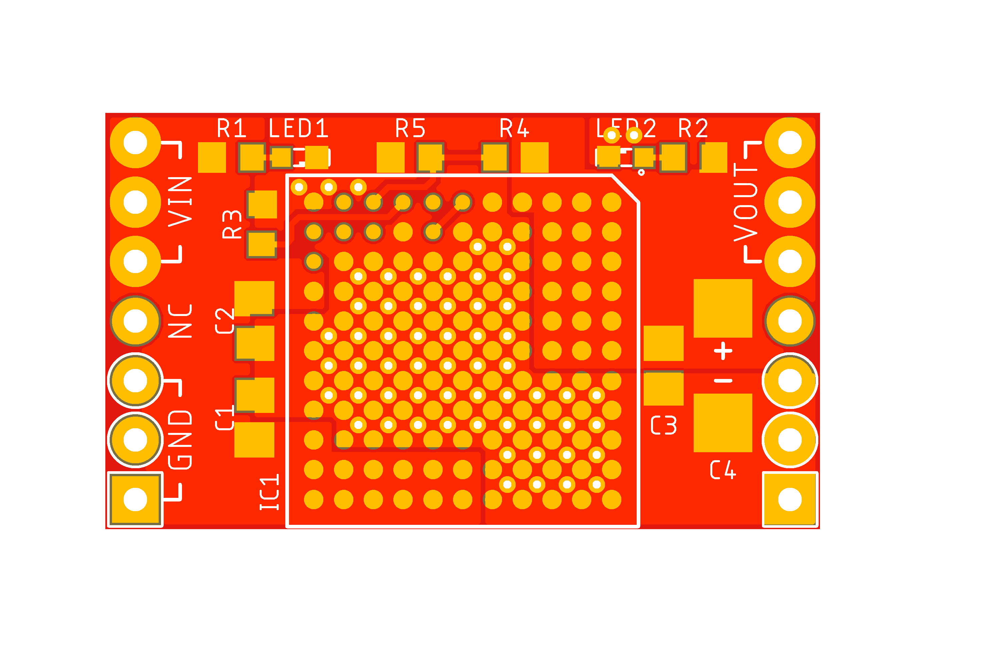
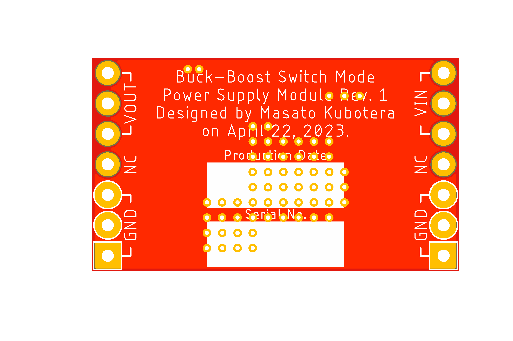

<html lang="en">

<head>
	<meta charset="uft-8">
	<meta name="author" content="Masato Kubotera">
    <meta name="description" content="">
</head>

<body>
    
<strong>This product is currently under development!</strong>

	<h1>Buck-Boost Switch Mode Power Supply Module</h1>
        

            <table>
                <tr>
                    <th>Top Surface of PCB</th>
                    <th>Bottom Surface of PCB</th>
                    <th>Assembled Electronic Components</th>
                </tr>
                <tr>
                    <td></td>
                    <td></td>
                    <td></td>
                </tr>
            </table>
        

	<h2>Features Rev. 1</h2>
        

            This product is a buck-boost switch mode power supply module. Supports the wide voltage input range of 5V to 36V, and 12V/6A output from 12V input. The switching frequency is configured at 600 kHz.
        

    <h3>PCB</h3>
        

            <ul>
                <li>12" x 7" (30.48 mm x 17.78 mm) PCB layout</li>
                <li>1" (2.54mm) pitch through-holes for pin headers
                    <ul>
                        <li>1 x 7 pin headers - 1
                            <ul>
                                <li><strong>3x VIN</strong>: Power In (5V to 36V)</li>
                                <li><strong>1x NC</strong>: Non Connection</li>
                                <li><strong>3x GND</strong>: Common Ground</li>
                            </ul>
                        </li>
                        <li>1 x 7 pin headers - 2
                            <ul>
                                <li><strong>3x VOUT</strong>: Power Out (Regulated 12V)</li>
                                <li><strong>1x NC</strong> Non Connection</li>
                                <li><strong>3x GND</strong>: Common Ground</li>
                            </ul>
                        </li> 
                    </ul>
                </li>
            </ul>
            
        

    <h3><a href="https://www.analog.com/en/products/ltm8055.html">LTM8055</a></h3>
        

            <ul>
                <li>Complete Buck-Boost Switch Mode Power Supply</li>
                <li>VOUT Equal, Greater, Less Than VIN</li>
                <li>Wide Input Voltage Range: 5V to 36V</li>
                <li>12V/3A Output from 6VIN</li>
                <li>12V/6A Output from 12VIN</li>
                <li>12V/8.5A Output from 24VIN</li>
                <li>Up to 97.5% Efficient</li>
                <li>Adjustable Input and Output Average Current Limits</li>
            </ul>
        

	<h2>Development Environments</h2>
    

        This product is designed with the following software.
            <ul>
                <li><a href="https://www.autodesk.com/products/eagle/overview">Autodesk Eagle 9.6.2</a></li>
            </ul>
    

    <h2>Repository Contents</h2>
        

            <dl>
                <dt><a href="/images">\images</a></dt>
                <dd>PCB preview images and capture of design screen</dd>
                <dt><a href="/libraries">\libraries</a></dt>
                <dd>Libraries used in Autodesk Eagle design</dd>
                <dt><a href="/documents">\documents</a> </dt>
                <dd>Documentation for making and using this product</dd>
                <dt><a href="/pcb_order">\pcb_order</a> </dt>
                <dd>Gerber data and documentation for ordering PCB</dd>
                <dt><a href="/schematic.pdf">schematic.pdf</a></dt>
                <dd>Circuit diagram of this product</dd>
                <dt>*.brd</dt>
                <dd>Board wiring design file by Autodesk Eagle</dd>
                <dt>*.sch</dt>
                <dd>Circuit diagram design file by Autodesk Eagle</dd>
                <dt><a href="/.gitignore">.gitignore</a></dt>
                <dd>A file that tells Git not to track a particular file</dd>            <dt><a href="/LICENSE">LICENSE</a></dt>
                <dd>License to use this product</dd>
            </dl>
        

    <h2>Documentation</h2>
        

            The following documents are available for this product.
            <ul>
                <li><a href="/pcb_order/README.md">\pcb_order\README.md</a>: Information for ordering the PCB</li>
                <li><a href="/documents/BOM.md">\document\BOM.md</a>: List of electronic components assembled on the PCB</li>
            </ul>
        

    <h3>Note</h3>
        

            The die temperature of the LTM8055/LTM8055-1 must be lower than the maximum rating of 125°C. Therefore, it is recommended that the following heat sinks be affixed to the LTM8055/LTM8055-1. 
            Details: <a href="https://www.analog.com/media/en/technical-documentation/data-sheets/LTM8055-8055-1.pdf#page=18">Analog Devices LTM8055/LTM8055-1 Data Sheet Page#18</a>
            <ul>
                <li><a href="https://amzn.asia/d/5Kmnowi">Awxlumv Aluminum Heatsink 14mm x 14mm x 6mm</a></li>
            </ul>
        

    <h2>References</h2>
        

            This product was designed with reference to the following products.
            <ul>
                <li><a href="https://www.analog.com/jp/design-center/evaluation-hardware-and-software/evaluation-boards-kits/dc2017a.html">Analog Devices DC2017A: LTM8055 Demo Board</a></li>
            </ul>
        

    <h2>Contact</h2>
        

            If you have any questions, please contact the designer of this product, Masato Kubodera, by <a href="mailto:masato.kubotera@sustaina-op.com">e-mail</a>. 
            E-mail: <a href="mailto:masato.kubotera@sustaina-op.com">masato.kubotera@sustaina-op.com</a>
        

    <h2>License Information</h2>
        

            This product is open source. Please review the <a href="/LICENSE">LICENSE</a> for license information. 
             
            This product by Masato Kubotera is licensed under a <a href="http://creativecommons.org/licenses/by-nc-sa/4.0/">Creative Commons Attribution-NonCommercial-ShareAlike 4.0 International License</a>.
        

</body>
</html>

